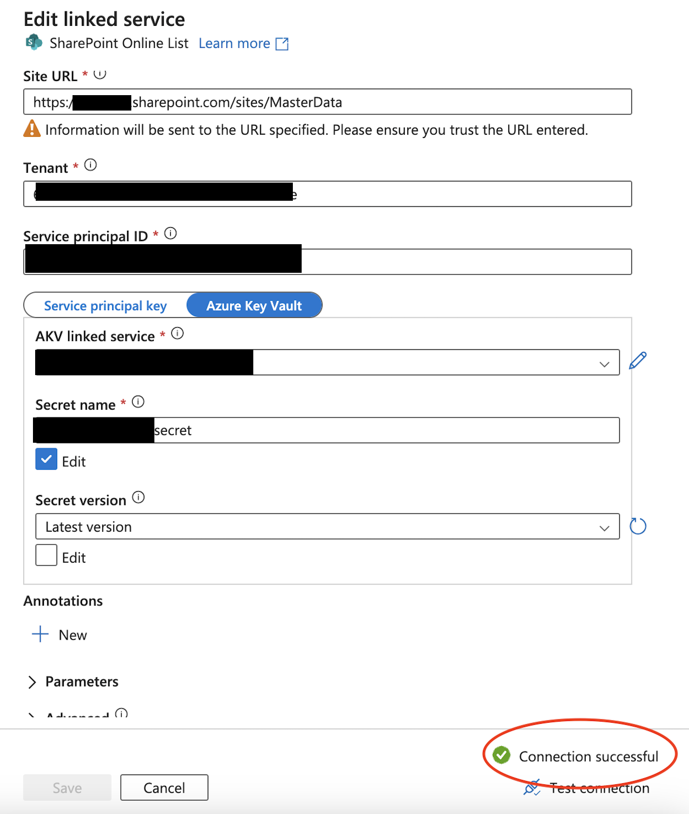

# Setting up Sharepoint so Azure Data Factory can access it

In this guide, we'll walk through the process of configuring Linked Service access to SharePoint Online through Azure Data Factory (ADF).

## You will need

To complete this guide, you will need:

- A Service Principal with API read permissions for SharePoint.
- An AD-user with either a SharePoint administrator or Global admin role.

## The Problem - Sharepoint vs. Azure Data Factory (after November 2018)
Setting up a Linked Service to SharePoint in Azure Data Factory utilizing a service principal might return an error message that reads: 

`
"Failed to get metadata of OData service, please check if service URL and credential is correct and your application has permission to the resource. Expected status code: 200, actual status code: Unauthorized, response is : {"error":"invalid_request","error_description":"Token type is not allowed."}."
`

This issue arises because SharePoint Online List in Data Factory employs "ACS" (Access Control Services) to obtain an access token, which in turn authorizes access to other applications. However, for tenants established post-November 7, 2018, ACS is disabled by default.

## Resolution

### Step 1: Enable Custom App Authentication and allow Site Owners to manage Service Principals in SharePoint
The following PowerShell commands should be run to resolve the issue. These commands perform necessary changes at the tenant level to enable legacy service principal management and custom app authentication:

```PowerShell
Connect-SPOService -Url https://<your-domain>-admin.sharepoint.com
Set-SPOTenant -SiteOwnerManageLegacyServicePrincipalEnabled $true
Set-SPOTenant -DisableCustomAppAuthentication $false
Disconnect-SPOService
```

### Step 2: Authorize Your Registered Application
To grant your registered application the required permissions on SharePoint Online:

1. Navigate to the SharePoint Online site permissions page at https://[your_site_url]/_layouts/15/appinv.aspx (replace [your_site_url] with your actual site URL).

2. Grab your Application ID from the Service Principal, and complete the necessary fields, and click "Create":

App Domain: contoso.com
Redirect URL: https://www.contoso.com
Permission Request XML: Input the following XML to request the necessary permissions:

```
<AppPermissionRequests AllowAppOnlyPolicy="true">
    <AppPermissionRequest Scope="http://sharepoint/content/sitecollection/web" Right="Read"/>
</AppPermissionRequests>
```

It's essential to understand that these modifications may potentially impact your organization's compliance posture, particularly if broad access permissions are granted. Hence, ensure to adhere to your organization's compliance and security guidelines when executing these changes.

### Step 3: Test your connection in Azure Data Factory
Upon completing the previous steps, your Linked Service in Azure Data Factory should now be able to connect to your SharePoint site utilizing the service principal.

<p align="center">
    
</p>

## Conclusion
This guide hopefully provided you with a clear path to resolving the common issue faced when configuring Linked Service access to SharePoint Online through Azure Data Factory.